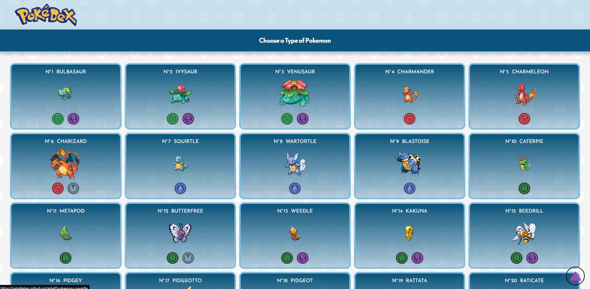
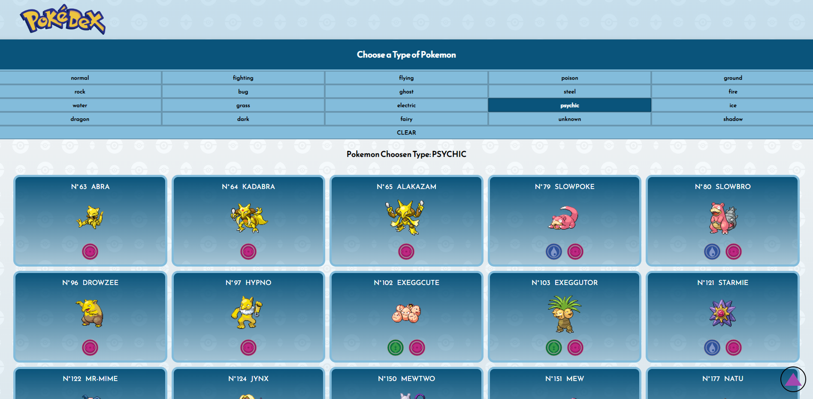
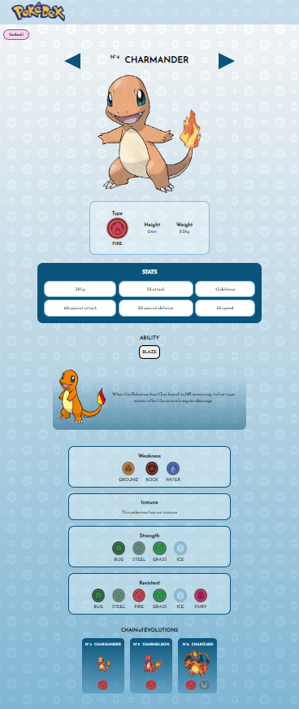

<!-- # Pokedex -->

#### Nacion Servicios Challenge: 
This project is a web of all pokemons with their details, abilities, stats, evolutions, etc.
This web allows the user to filter pokemons by their type.

## Demo Link

This link of the website is a demo of the project, this may not work perfectly
[Link](https://artebleker.github.io/react-nssa-exercise/)

## Website Preview

The full list of all 905 Pokemon appears on the landing page



The user can easily filter by their types



The site is fully responsive.
This is a detail view of a pokemon.



## Installation

Use the package manager [npm](https://www.npmjs.com/package/npm) to install [node_modules](https://nodejs.org/api/modules.html) and the library [axios](https://axios-http.com/docs/intro).

```bash
npm install
```
## Local host

These instructions will allow you to get a working copy of the project on your local machine for development and testing purposes.

```bash
npm run start
```

## Build and deploy the project

These instructions will allow you to get the full project ready for use in your web host.

```bash
npm run build
```
*and when this process ends:*
 
```bash
npm run deploy
```

## Used technology

This project was made using:

* [React js](https://es.reactjs.org/)
* [JavaScript](https://www.javascript.com/)
* [AXIOS](https://axios-http.com/docs/intro)
* [HTML](https://html.com/)
* [CSS](https://www.w3.org/Style/CSS/Overview.en.html)

## Author

#### Julián Bleker

*[LinkedIn](https://www.linkedin.com/in/julian-bleker/)*
*[GitHub](https://github.com/artebleker)*
